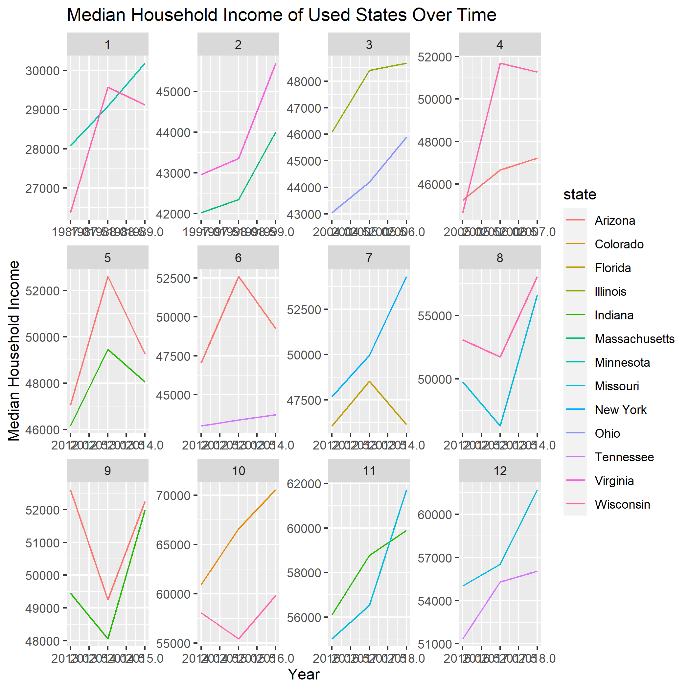
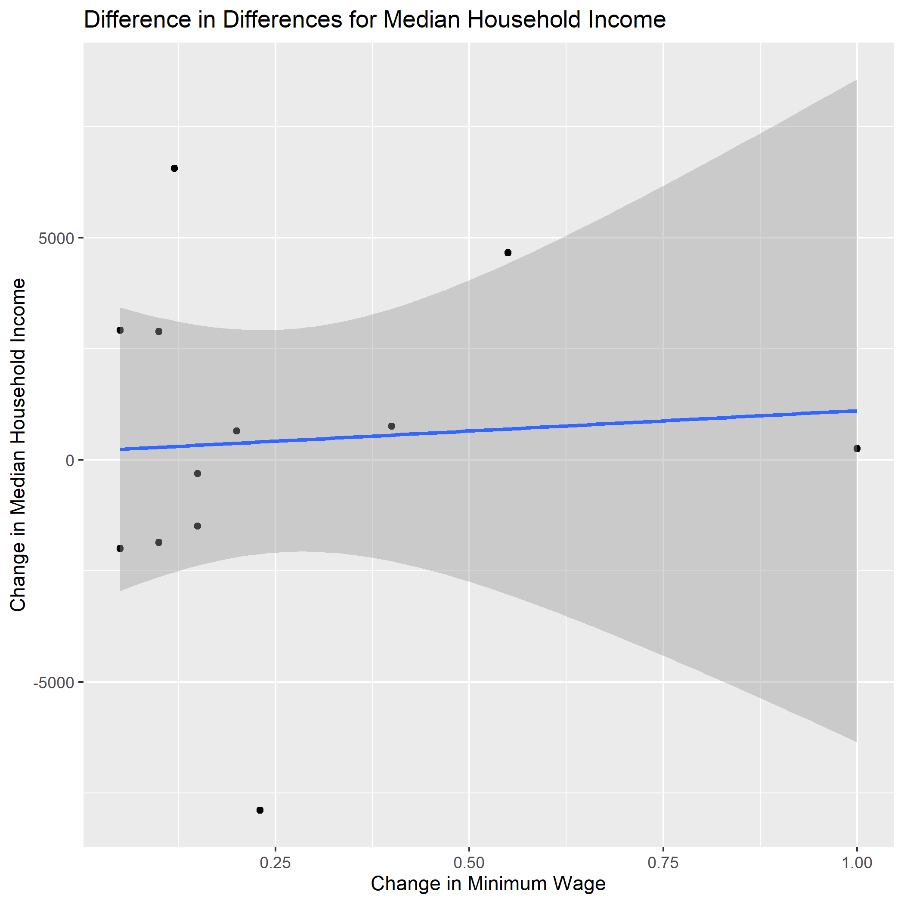
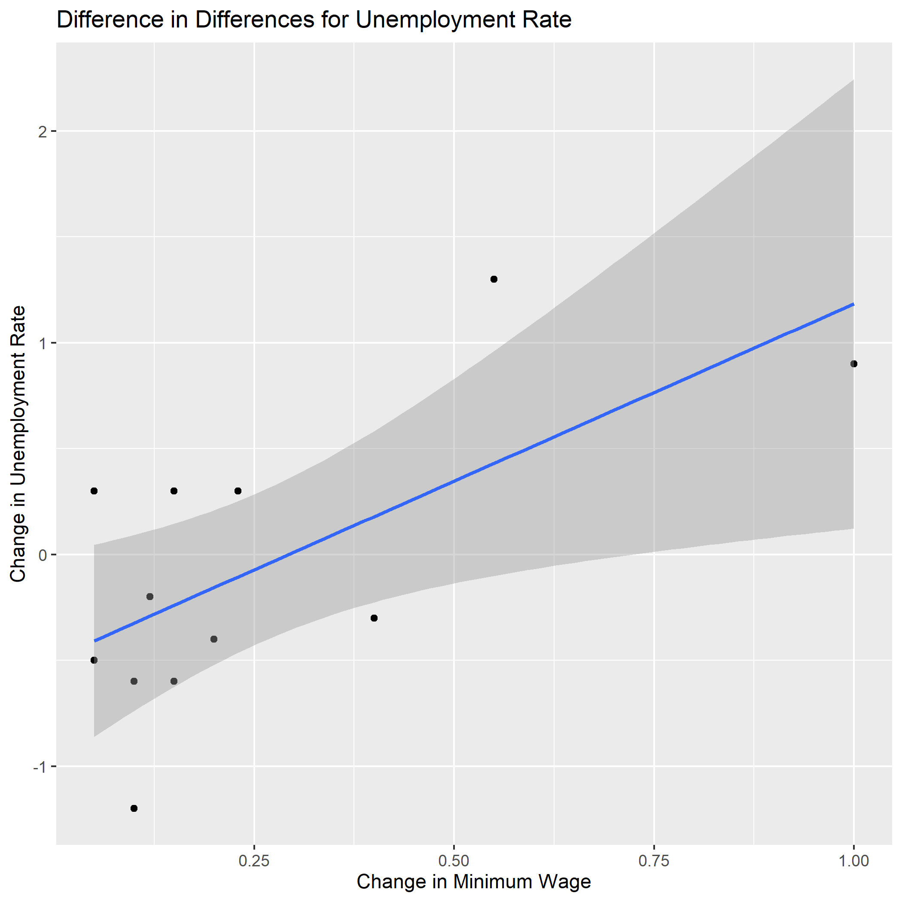

```{r setup, include=FALSE}
knitr::opts_chunk$set(echo = TRUE)
library(tidyverse)
```

# Introduction:
An increase in the minimum wage is often proposed towards the economic well-being within a society under the conventional perception that increased minimum wage helps households to be more financially stable. However, it is often argued that the proposed benefits of increasing minimum wage such as increasing personal income with same working hours do not outweigh the downside of employers considering laying off some of their employees to reduce some of their expenses and increasing overall unemployment. Considering these proposed consequences, would the effect of increasing minimum wage still help increasing household income while the employment rate is declining? 

Through observing and processing historical data on minimum wage, household income and unemployment rate, our group aims to answer these questions. Our alternative hypothesis for the question is that unemployment rates will increase, but the total income of households will increase as lower paid workers gain more wage every working hour. Naturally, our null hypothesis is that there is no change in unemployment or household income for change in minimum wage.


# Data:
## Source:
We had two primary sources for our data. The first source where we got our minimum wage data came from a cleaned dataset on Kaggle which compiled minimum wage values in each state for each year as reported by the United States Department of Labor. The data set was last updated 5 months ago so it is up to date and relevant to our research. The second source we used was the FRED, St. Louis Fed, who extensively gathers economic data and conducts economic research. They get some of their data from the U.S. Bureau of Labor Statistics. We used the Fred website to strip the data we needed for each state, specifically to gather unemployment rates, the labor population, and median household income. Our data came from government/quasi-government websites that collect and report data. One can assume that the sources for the data are credible and portray accurate data for the basis of our research.

## Measurements:
State (state) - list of all fifty states in the U.S.

Year (year) - years in which information was collected about different states starting from 1985 and until 2018.

Unemployment Rate (unem.rate) - shows the rate at which people were unemployed starting from 1985 and until 2018 in the different states in the U.S.

Minimum Wage (min.wage) - shows hourly minimum wage starting from 1985 and until 2018 in the different states in the U.S.

Household Income (house.income) - used as a measurement of economic livelihood. It indicates how much money the median household in the United States is making each year. For our purposes, median household income was chosen because it is the most available source of data for income in the United States, making our data more reliable. The real target population for the benefits of increasing minimum wage are low income individuals and households, and while we expect increases in minimum wage to be somewhat reflected in median household income, this measure isn’t fully representative of our actual target demographic. However, because data on isn’t readily available on a large scale for low income households, we chose to use median household income as the best estimate available to us. 

Labor Populations (labor.pop) - working population in different states from 1985 to 2018.

## Dependent Variable Graphs:



# Results: 






# Conclusion:
The first graph above depicts how unemployment changes in the years following a change in a state’s minimum wage. The graph shows that a very minor change in minimum wage at around 10 cents actually causes a decrease in unemployment in the following years, with larger changes to minimum wage at a dollar causing a 1% increase in unemployment. The end of the trend line is consistent with our hypothesis that increases in minimum wage cause an increase in unemployment, but we were surprised by the decrease in unemployment at lower increases in minimum wage. 

The second graph depicts an almost flat trend line around 0 for changes in median household income as a result of changes in minimum wage. This goes against our original hypothesis that household income would increase as a result of increasing minimum wage, but we should reiterate that the important demographic for increasing minimum wage is low income families and it is possible that this effect is still occurring, but simply not captured by the measure of median household income. Therefore, this data is certainly not evidence that increasing minimum wage increases income of poor households, but it is also questionable as evidence against the claim that increasing the minimum wage increases income for poor households.
The biggest threat to inference in our analysis is whether or not our matched pairs of states are actually reasonable substitutes for each other and if we could assume that the future values of unemployment and household income would be the same between these two states if one of them hadn’t received the treatment of a change in minimum wage. We did our best to make states as comparable as possible, but without the ability to randomize which states get the treatment and which ones don’t, it’s impossible to account for everything.

In our process for finding pairs of states that were comparable enough for one to provide the counterfactual for the other receiving the treatment of a change in minimum wage, we made the arbitrary decision to say that states were comparable if one states value for a variable divided by the other states value was greater than or equal to 0.9. This ensured that states had similar starting minimum wages, median household incomes, unemployment rates, and labor populations. When we increased this threshold, our resulting regression lines remained similar until there weren’t enough data points to make any reasonable inference. When decreasing this threshold, the regression lines again remain fairly similar until about 0.8, at which point we don’t think the states are really comparable and the regression lines are no longer meaningful. 

Another threat to inference is that changes in economic policy often have delayed results as the economy is a deeply interconnected construction where a small change in one area ripples out and can have profound impacts in other areas. The point is that the manifestation of these effects take time to appear, and we tried to account for this by taking our secondary observations for values of variables a full year after the initial change was made. This introduces the issue that other changes can occur in that year between observations such as additional changes in minimum wage in either the control or treatment state, but we thought that those secondary changes in minimum wage would themselves have delayed effects and that overall this choice would increase internal validity. 

The final threat to inference is that it is possible that states are self-selecting into the treatment group and that there is a systematic difference between states that choose to increase minimum wage and those that don’t. We considered dealing with this by only including states in the treatment group who increased minimum wage because of a federal increase in minimum wage, but this doesn’t solve the issue of self-selection because then states would be putting themselves into the control group by having a minimum wage higher than the federal one and not needing to increase their own to meet federal requirements.